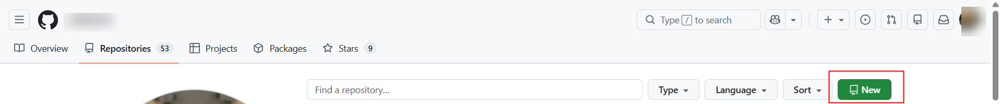
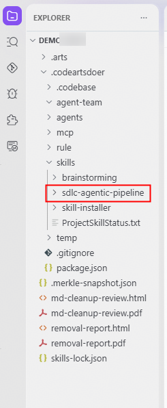
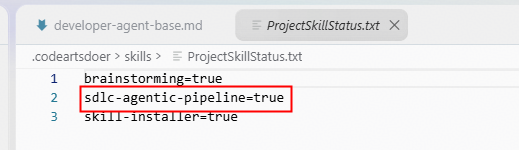
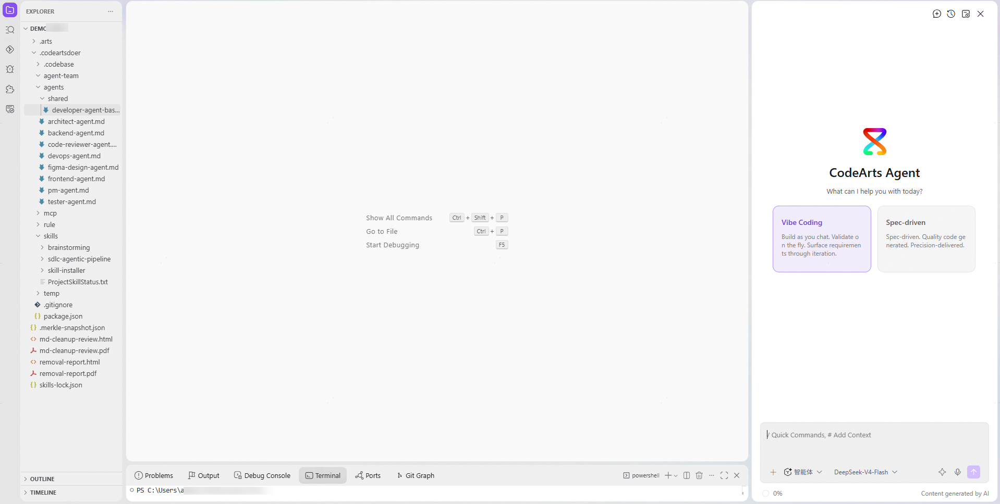
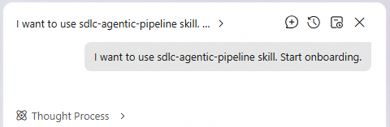
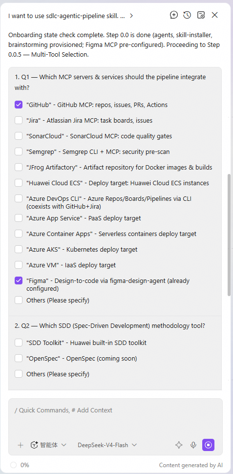
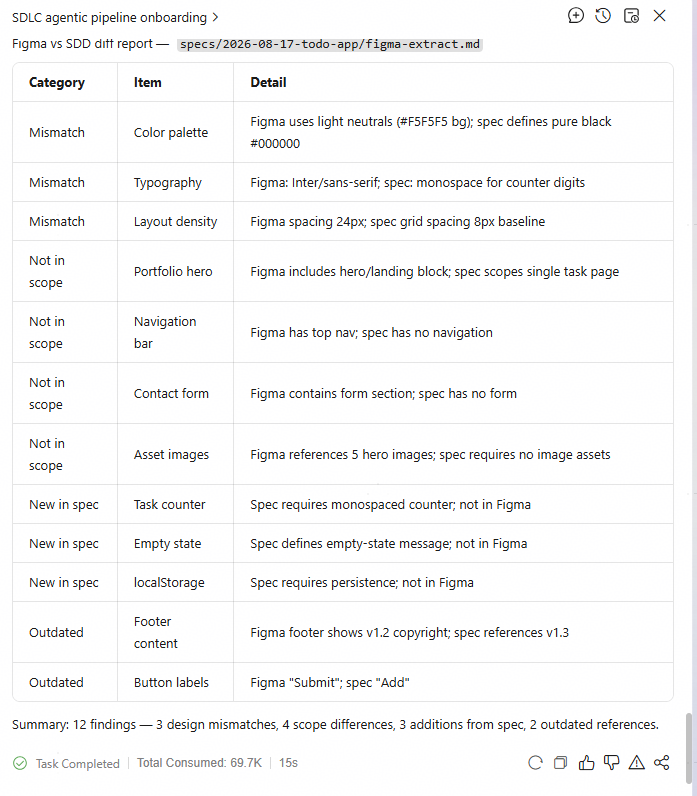
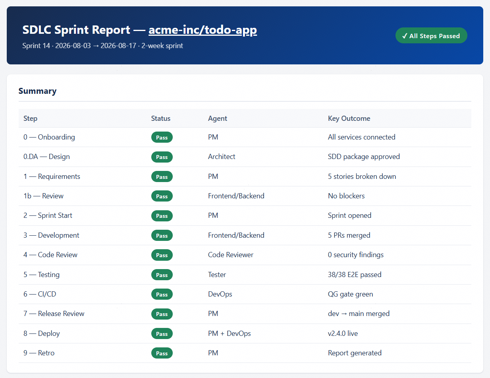

---

# SDLC Agentic Pipeline Skill Guide (How to Use This Skill)

## 1.1 What Is the SDLC Agentic Pipeline Skill?

The SDLC Agentic Pipeline is the core skill used in this hands-on. It is a multi-agent orchestration skill for Huawei Cloud CodeArts Agent that carries a feature request from raw requirements all the way to deployment. Eight specialized agents collaborate across ten steps, using Jira comments as the message bus, with human-in-the-loop checkpoints at every stage boundary.

It integrates: GitHub (repositories, branches, PRs), Jira (Epic → Issue → Task work items and sprints), SonarCloud (quality gate), Semgrep (security pre-scan), JFrog Artifactory (artifact storage), Playwright (E2E UI testing), Huawei Cloud ECS (deployment), Azure DevOps (optional) and Figma (design-to-code, optional).

> **Note:** The skill runs inside CodeArts Agent. The environment configuration in Part 1 (Node.js setup, CodeArts installation and login, CodeArts subscription, Playwright Chromium) must be completed before you can use the skill.

**Tool glossary:**
- **GitHub** — code hosting, branches and pull requests.
- **Jira** — project management: the work-item tree (Epic → Issue → Task), sprints and the agent message bus.
- **SonarCloud** — code-quality gate.
- **Semgrep** — security pre-scan of code.
- **JFrog Artifactory** — artifact storage for builds.
- **Playwright** — E2E UI testing.
- **Huawei Cloud ECS** — the virtual server where the finished system is deployed.
- **Figma** — design-to-code (optional).
- **Azure DevOps** — optional alternative platform for repos/boards/pipelines.

### Key concepts for beginners

| Term | Meaning in this hands-on |
| --- | --- |
| Agent | A role with a dedicated instruction file (e.g. `pm-agent.md`, `tester-agent.md`). The PM agent is the orchestrator; the others are subagents that do specific jobs. |
| Skill | A folder of instructions under `.codeartsdoer/skills/` (e.g. `sdlc-agentic-pipeline/`) that teaches CodeArts Agent how to do something. Skills are enabled per project in `ProjectSkillStatus.txt`. |
| MCP | Model Context Protocol — the standard that connects the agent to external tools (GitHub, Jira, Figma, SonarCloud, …). The agent uses an MCP server per tool, configured in `.codeartsdoer/mcp/mcp_settings.json`. |
| SDD | Spec-Driven Development — the methodology of this hands-on. It produces three documents per feature: `spec.md` (what to build), `design.md` (how to build it) and `tasks.md` (the work breakdown). |
| Vibe Coding vs Spec-driven | Two ways to work with the agent (see the panel in the CodeArts IDE). This hands-on uses Spec-driven mode. |
| Message bus | Agents never talk to each other directly; they communicate by posting comments on Jira work items. Watch the work-item comments to follow progress. |
| Human-in-the-loop | The pipeline stops at every stage boundary and waits for your confirmation before continuing. |
| Token quota | Your subscription includes a monthly token allowance (Basic ≈ 2M tokens/seat/month). Long agent chains consume a lot of it. |

## 1.2 Skill Structure — What Each Part of the Skill Does

The skill lives in the project under `.codeartsdoer/skills/sdlc-agentic-pipeline/`. Each file has a specific job:

| Path | Purpose |
| --- | --- |
| `SKILL.md` | Entry point. Defines the 8 agents, the 10-step table, the permission matrix, the quick start and the key execution rules. |
| `pipeline.md` | Step-by-step orchestration reference: what each pipeline step does, who owns it, and how it behaves conditionally. |
| `agents/pm-agent.md` | Project manager: requirement analysis, requirement breakdown, Jira Epic → Issue → Task creation, sprint management, release review and deployment authority. Runs as the orchestrator. |
| `agents/architect-agent.md` | Architect: design phase; the SOLE creator of the SDD files `spec.md` / `design.md` / `tasks.md`. |
| `agents/backend-agent.md` | Backend developer: implements server logic, APIs and database per `spec.md` / `design.md` / `tasks.md`. |
| `agents/frontend-agent.md` | Frontend developer: implements the UI; reads Figma tokens and assets when Figma is selected. |
| `agents/code-reviewer-agent.md` | Code reviewer: reviews PR diffs, scans for secrets, enforces code quality and signs off before CI/CD. |
| `agents/tester-agent.md` | Tester: owns E2E/Playwright tests, writes `test.md`, runs tests, performs the visual diff vs Figma and produces the test report. |
| `agents/devops-agent.md` | DevOps: builds the CI/CD pipeline, verifies JFrog artifacts, runs SonarCloud scans and deploys to Huawei Cloud ECS. |
| `agents/figma-design-agent.md` | Figma design: Figma-vs-SDD diff; the ONLY agent allowed to call the Figma MCP tools. |
| `agents/shared/developer-agent-base.md` | Shared base rules inherited by the backend and frontend agents. |
| `setup/service-onboarding.md` | Step 0: connects GitHub, Jira, SonarCloud, Semgrep, JFrog, ECS, Azure DevOps and Figma one by one. |
| `setup/multi-tool-selection-plan.md` | Step 0.0.5: the 4 tool-selection questions (MCP servers, SDD, TDD, DDD) and how the selections drive the pipeline. |
| `setup/critical-warnings.md` | Known pitfalls and their workarounds (e.g. Jira 401, sprint-name limits, SonarCloud auto-analysis). |
| `branch-strategy.md` | Branch strategy: `main` (production) ← `dev` (integration) ← `feature/fix` branches, and the PR merge gate. |
| `report-spec.md` | Specification of the Step 9 HTML report (`reports/sdlc-report.html`). |
| `config-reference.md` | Description of all templates and runtime config files (`mcp-settings.json`, `ci-cd.yml`, `.env`, sprint scripts, etc.). |
| `skill-registry.json` | Registry of selectable methodology skills (SDD / TDD / DDD) that drives the selection UI. |
| `templates/` | Ready-to-fill templates: `mcp-settings.json`, `ci-cd.yml`, `azure-pipelines.yml`, `sonar-project.properties`, `env-template.env`, sprint scripts, etc. |

## 1.3 The 8 Agents and Their Roles

| Agent | What It Does | Pipeline Steps |
| --- | --- | --- |
| **PM Agent** | Overall coordination, requirement breakdown, Jira Epic → Issue → Task creation, sprint start/close, release review, deployment authorization and the final HTML report. Orchestrates all other agents. | 0, 1, 2, 5, 7, 8, 9 |
| **Architect Agent** | Design phase: classifies the task and creates the SDD documents in strict order (`spec.md` → `design.md` → `tasks.md`). Sole creator of SDD files. | 0.DA |
| **Backend Agent** | Implements backend code: APIs, database and server logic. Writes API tests. | 0, 1b, 2, 3, 5, 7, 9 |
| **Frontend Agent** | Implements the frontend: UI pages, components and styles; applies Figma tokens when Figma is selected. Writes unit/component tests. | 0, 1b, 2, 3, 5, 7, 9 |
| **Code Reviewer Agent** | Reviews PRs and local diffs, security and secret scanning, and the quality sign-off gate before CI/CD. | 4 |
| **Tester Agent** | Owns E2E testing via Playwright, writes `test.md` and test scripts, runs the visual diff vs Figma, and produces the test report with coverage. | 5 |
| **DevOps Agent** | CI/CD pipeline, JFrog artifact verification, SonarCloud scan, and deployment scripts for Huawei Cloud ECS. | 0, 6, 8 |
| **Figma Design Agent** | (Optional) Compares the Figma design against the SDD spec and updates the SDD docs after user confirmation. Only agent that calls Figma MCP. | 0.F |

## 1.4 The 10-Step Pipeline at a Glance

| Step | Agent(s) | What Happens |
| --- | --- | --- |
| 0 | PM + all agents | Service onboarding: agent files auto-provisioned, tool-selection questions answered, services connected. |
| 0.DA | Architect | Design phase: task classified, SDD documents created (`spec.md` → `design.md` → `tasks.md`). |
| 0.F | Figma Design | (Optional) Figma-vs-SDD diff; SDD docs updated after user confirmation. |
| 1 | PM | Requirement breakdown, PRD, and the Jira Epic → Issue → Task work-item tree. |
| 1b | Frontend + Backend | Requirement review: approve or give feedback via Jira comments. |
| 2 | PM | Sprint started; all leaf-level tasks added to the sprint. |
| 3 | Frontend + Backend | Parallel development, unit tests, Semgrep pre-scan and PRs created from feature branches. |
| 4 | Code Reviewer | PR review and secret scanning; approval required before testing. |
| 5 | Tester + PM + Dev | E2E tests via Playwright, visual diff vs Figma, feature PRs auto-merged on pass. |
| 6 | DevOps | CI/CD auto-triggered on push to `dev`; JFrog artifacts verified; SonarCloud quality gate. |
| 7 | PM + Developer | Release review and merge of `dev` → `main`. |
| 8 | PM + DevOps | Deployment authorized by PM and executed on Huawei Cloud ECS. |
| 9 | PM + Developer | Sprint closed, retrospective and HTML report generated and pushed via PR. |

## 1.5 Recommended Model

The pipeline runs a long chain of agent tasks, so the model choice matters. Use the strongest reasoning and coding model available in CodeArts Agent for your subscription, with strong tool-calling and long-context support, and keep the same model for all agents to avoid inconsistent behavior.

**Design-to-code work:** the skill's own documentation recommends **GLM 5.2** as the primary model (best end-to-end single model — it reads Figma structured data and rendered page images, understands large frontend repositories, calls Figma MCP / terminal / browser tools and executes long-running tasks), with **DeepSeek v4 Flash** as the open-ecosystem alternative. For pure orchestration steps (PM / Architect) any model with strong agentic tool use works well.

**Token quota:** keep it in mind — the Basic Edition includes about 2M tokens per seat per month, and a full pipeline run consumes a significant share of it.

## 1.6 How to Use the Skill — Step by Step

### Step 1 — Create the GitHub repository manually

The pipeline never creates repositories — repo creation is a manual, human-only action. Create the repository on github.com (e.g. `reimbursement-system`) and note the owner and repository name; you will need them during onboarding.

### Step 2 — Install the skill into the project

Copy the `sdlc-agentic-pipeline` folder (provided in the course files) into `.codeartsdoer/skills/` inside the project folder. The folder contains `SKILL.md`, the `agents/`, `setup/` and `templates/` references, and the bundled brainstorming skill.

### Step 3 — Enable the skill

Append `sdlc-agentic-pipeline=true` to the file `.codeartsdoer/skills/ProjectSkillStatus.txt` so CodeArts Agent loads the skill.

### Step 4 — Open the project and log in

Open the project folder in CodeArts Agent (`File → Open Folder`) and make sure you are logged in with the Huawei personal account (China region) configured in Part 1.

### Step 5 — Run Step 0 (Service Onboarding)

Send a first message to start the pipeline (see section 1.7). The PM agent runs Step 0 and asks you to select tools via multiple-choice questions: MCP servers (GitHub, Jira, SonarCloud, Semgrep, Figma, …) and methodology (SDD, TDD, DDD). Answer them — the selections are saved to `.codeartsdoer/tool-selections.json` and drive the whole pipeline.

> **WARNING — Azure CLI manual installation is recommended:** if you plan to use Azure DevOps (optional integration), install the Azure CLI (`az`) yourself before starting the pipeline. Do not rely on the agent to install it — download and run the official installer, then verify with `az --version`. The Azure DevOps CLI is used by the agents for repositories, boards and pipelines when Azure DevOps is selected.

### Step 6 — (Optional) Figma design flow, Step 0.F

If Figma was selected and an SDD directory exists, invoke the Figma Design agent with a Figma URL to run a Figma-vs-SDD diff before the design phase. The agent updates `spec.md` / `design.md` / `tasks.md` after you confirm each finding.

### Step 7 — Follow the pipeline with human checkpoints

The PM agent presents the requirement breakdown and the Jira Epic → Issue → Task tree for confirmation, then dispatches the work: development (Step 3), code review (Step 4), E2E testing (Step 5), CI/CD (Step 6), release (Step 7) and deployment (Step 8). Confirm each hand-off when asked.

### Step 8 — Sprint close and report (Step 9)

At the end, the pipeline closes the sprint, runs a retrospective and generates an HTML report at `reports/sdlc-report.html` with clickable links to every service (GitHub, Jira, SonarCloud, JFrog, pipeline runs, deployment URL), then pushes it via a PR.

### Where the outputs live

| Path | Content |
| --- | --- |
| `reports/sdlc-report.html` | The final sprint report with clickable links to every service. |
| `.codeartsdoer/tool-selections.json` | Your answers to the tool-selection questions. |
| `specs/<date>-*/spec.md`, `design.md`, `tasks.md` | The SDD documents created by the Architect agent. |
| `specs/<date>-*/figma-extract.md` | Extracted Figma data (created when Figma is used). |
| Git branches | `feature/<agent>/<description>` → `dev` → `main` (production). |

### What to expect during a run (first time)

- The `[SCREENSHOT REQUIRED]` note in Step 7 is a placeholder in the original document — capture your own Jira board when you reach that point.
- **Re-running is safe (idempotent):** it detects existing sprints, PRs and artifacts and skips completed steps.
- Steps that depend on tools you did not select are skipped, not errors (graceful degradation).
- The pipeline pauses at every stage boundary and asks for your confirmation. Confirm each hand-off when asked; this is the human-in-the-loop design, not a stuck state.
- A full run is a long chain of agent tasks — expect it to take a while, and keep CodeArts Agent open. The PM agent orchestrates; the work moves through Jira comments, so check the work-item comments to follow progress.

## 1.7 What Prompt to Write

Trigger phrases recognized by the skill: `"start agentic flow"`, `"SDLC pipeline"`, `"agentic DevOps pipeline"`, `"multi-agent development workflow"`, `"figma to code"`.

**Example 1 — short prompt:**

> Start agentic flow. Build an enterprise reimbursement management system with a Vue3 + Vite frontend and a Node.js + Express backend. Roles: admin and employee. The admin can create employee accounts and approve reimbursement documents; employees can submit reimbursement documents and the required reimbursement information.

**Example 2 — recommended full prompt for this hands-on:**

> Start agentic flow for the reimbursement management system.
> - Frontend: Vue3 + Vite
> - Backend: Node.js + Express
> - Roles: admin and employee (no preset accounts; the admin creates them after login)
> - Admin: create employee accounts, approve reimbursement documents
> - Employee: submit reimbursement documents and the required reimbursement information
> - Repository: `https://github.com/<owner>/<repo>` (already created manually)
> - Tools: GitHub + Jira + SonarCloud + Semgrep + Playwright + Huawei Cloud ECS
> - Run Step 0 onboarding first, then Step 0.DA design, and walk through the full pipeline with human confirmation at each stage.

**Tips:** Write prompts in English. Be specific about the requirements and acceptance criteria. Do not tell the PM agent how to code — it delegates implementation to the backend/frontend agents. Confirm each hand-off when the agent asks.

## 1.8 Tips and Common Pitfalls

- Repository creation is manual — create the GitHub repo before starting; the pipeline never creates repos.
- Figma MCP is exclusive to the Figma Design agent. All other agents read Figma data from `specs/<date>-*/figma-extract.md`.
- SDD files (`spec.md`, `design.md`, `tasks.md`) are created only by the Architect agent — no other agent may create or modify them.
- The PM agent is the orchestrator: it never codes, tests or fixes bugs itself; it dispatches tasks to the proper agents.
- Agents communicate through Jira comments (the message bus) — watch the work-item comments to follow progress.
- The pipeline pauses for your confirmation at every stage boundary (human-in-the-loop).
- CI/CD auto-triggers on push to `dev`; branches follow `main` ← `dev` ← `feature/<agent>/<description>`.
- The pipeline degrades gracefully: steps that depend on unselected tools are skipped, not errors.
- Re-running the pipeline is safe (idempotent): it detects existing sprints, PRs and artifacts and skips completed steps.
- Azure CLI (`az`) manual installation is recommended if you select Azure DevOps — install it yourself and verify with `az --version`; do not rely on the agent to install it.
- Watch the token quota — a full pipeline run consumes the monthly tokens (Basic Edition ≈ 2M tokens/seat/month).

### Troubleshooting for beginners

The original document's own warning list (section 1.8) plus the skill's `setup/critical-warnings.md` cover the known pitfalls. The most common learner issues, distilled:

| Symptom | Likely cause | Fix |
| --- | --- | --- |
| `node`/`npm` not recognized | Node.js folder not on `Path`, or terminal not restarted | Reconfigure the system `Path` (Part 1), open a new terminal, retry `where node` |
| `npx playwright install chromium` fails | Network / proxy restrictions | Check network and proxy, retry; ensure Node/npm versions match the guide |
| CodeArts Agent asks for permission constantly | Security policies still enabled | Disable the relevant agent security policies (Part 1, Configuration CodeArts Agent Settings) |
| SonarCloud CI crashes: `"running CI analysis while Automatic Analysis is enabled"` | SonarCloud Automatic Analysis left on | Project Dashboard → Administration → Analysis Method → turn OFF Automatic Analysis (needs Project Administrator) |
| Jira direct API calls return 401 | Direct `{site}.atlassian.net` REST is blocked | Use the Atlassian API gateway (`api.atlassian.com/ex/jira/{cloudId}/rest/…`) with the MCP auth header; find `cloudId` via the tenant info endpoint |
| Sprint creation fails with 400 | Sprint name too long | Keep sprint names under 30 characters |
| `"In Testing"` status missing | Not created in Jira by default | Add it manually: Settings → Work items → Workflows → Edit → Add status `"In Testing"` (category: In Progress) |
| Pipeline did not create the repo | Repo creation is manual by design | Create the repository on GitHub yourself before starting |
| `az` command not found | Azure CLI not installed | Install the Azure CLI manually, verify with `az --version` (do not rely on the agent) |
| JFrog repository errors | Underscores in repo names | Use hyphens, e.g. `docker-dev-local`, not `docker_dev_local` |
| Pipeline stops with token errors | Monthly token quota exhausted | Wait for quota renewal or reduce runs; re-running is idempotent so completed steps are reused |

## Security and hygiene reminders

- `.codeartsdoer/mcp/mcp_settings.json` contains authorization headers — never commit it to the repository.
- Copy `templates/env-template.env` to `.env` for secrets and keep `.env` out of version control (it is gitignored).
- The SonarCloud token is not a GitHub PAT — create one at `sonarcloud.io/account/security/`.
- Temporary scripts that contain tokens should be deleted after use.
- On Windows, the CodeArts Bash tool strips `$` from inline PowerShell commands — write a `.ps1` script file first and execute it with `powershell -NoProfile -ExecutionPolicy Bypass -File <script>`.

## Suggested learning path for new employees

1. Read this guide and the original document once end to end.
2. Complete Part 1 (pre-class configuration) on your own machine and tick the completion checklist.
3. Before the full system, practice with a tiny project (for example a simple todo app) to see the 10-step pipeline from start to finish and get used to the confirmation checkpoints.
4. Run the full reimbursement management system hands-on with the recommended prompt in section 1.7.
5. Use the Invoice sample file with the Playwright skill to test the reimbursement flow, and use the `renjismzy-mcp-code` MCP service to inspect the front-end and back-end code.
6. Extend afterwards: try the optional Figma design-to-code flow, add your own acceptance criteria to prompts, and read `reports/sdlc-report.html` to see how every service is linked.
